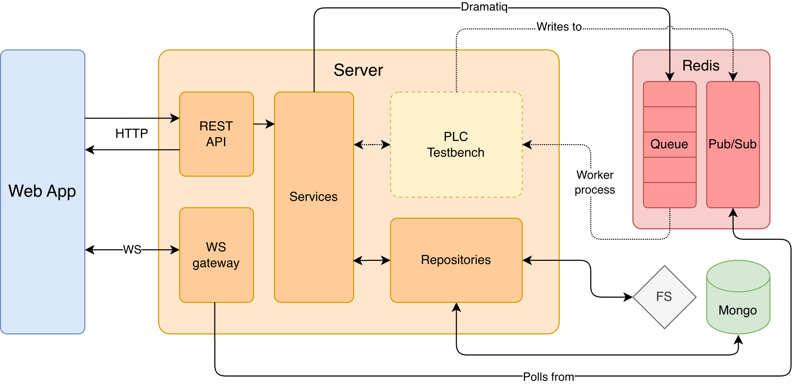

# OpenPLC Studio - Streamlined PLC Algorithm development

Self-contained Docker Compose stack for the released OpenPLC Studio application.
It wires together the published **frontend** and **backend** images with the
supporting infrastructure (MongoDB, Redis, reverse proxy).



## Requirements

| Requirement    | Notes                                                           |
| -------------- | --------------------------------------------------------------- |
| Docker Engine  | 24+ recommended                                                 |
| Docker Compose | v2.23+ (uses `depends_on` health conditions)                    |
| Architecture   | `linux/amd64` (recommended)                                     |
| CPU            | Backend is CPU-only (no GPU image)                              |
| RAM            | 4 GB minimum                                                    |
| Disk           | Artifacts accumulate; plan for the size of your audio test sets |

No sources are needed: this folder only references pre-built images.

## Installation

```bash
# 1. Create your environment file
cp .env.example .env

# 2. Edit configuration
$EDITOR .env

# 3. Pull the published images and start everything in the background
docker compose pull
docker compose up -d

# 4. Open the platform
#    http://localhost:<HTTP_PORT>     (default http://localhost:6767)
```

Check that everything came up:

```bash
docker compose ps
docker compose logs -f backend
```

Stop / remove the stack:

```bash
docker compose down             # stop and remove containers (data is kept)
docker compose down -v          # ALSO delete volumes (Mongo, Redis, artifacts)
```

## Files in this folder

| File           | Purpose                                             |
| -------------- | --------------------------------------------------- |
| `compose.yaml` | The whole stack definition.                         |
| `.env.example` | Template for `.env`; documents every variable.      |
| `nginx.conf`   | Reverse proxy routing `/api`, `/ws` and the SPA.    |
| `plugins/`     | Drop-in folder for user PLC algorithms (see below). |
| `assets`       | Images and other static assets.                     |
| `README.md`    | This file.                                          |

## Published images

The stack pulls these public Docker Hub images:

```text
cimil/plc-platform-backend:<BACKEND_IMAGE_TAG>
cimil/plc-platform-frontend:<FRONTEND_IMAGE_TAG>
```

- `latest`, for convenient upgrades;
- `sha-<full-git-sha>`, for immutable deployments and rollbacks.
- release-specific tags.

For a repeatable deployment, pin `BACKEND_IMAGE_TAG` and
`FRONTEND_IMAGE_TAG` to the `sha-*` tag produced by each repository's workflow.
For the simplest installation, keep both tags set to `latest`.

## Configuration reference

All variables live in `.env` (loaded automatically by Compose). Compose also
substitutes them into `compose.yaml`.

| Variable                     | Required | Default               | Description                                                                                                                                                                                                                     |
| ---------------------------- | -------- | --------------------- | ------------------------------------------------------------------------------------------------------------------------------------------------------------------------------------------------------------------------------- |
| `APP_PLATFORM`               | no       | `linux/amd64`         | Application-image architecture. Keep this on Apple Silicon until native `linux/arm64` application images are released; Docker Desktop will emulate amd64. MongoDB, Redis, and nginx select their native platform automatically. |
| `HTTP_PORT`                  | no       | `80`                  | Host port published by the reverse proxy.                                                                                                                                                                                       |
| `MONGO_INITDB_ROOT_USERNAME` | **yes**  | —                     | MongoDB root user.                                                                                                                                                                                                              |
| `MONGO_INITDB_ROOT_PASSWORD` | **yes**  | —                     | MongoDB root password.                                                                                                                                                                                                          |
| `MONGO_DATABASE`             | no       | `plc-testbench`       | Database used by the backend.                                                                                                                                                                                                   |
| `REDIS_URL`                  | no       | `redis://redis:6379`  | Redis connection URL.                                                                                                                                                                                                           |
| `PLC_ROOT_FOLDER`            | no       | `./artifacts-storage` | Artifact storage path **inside** the backend container file system. Keep the `./<dir>` shape.                                                                                                                                   |
| `PLUGINS_DIRECTORY`          | no       | `./user-plugins`      | Plugin path **inside** the backend container file system. Keep the `./<dir>` shape.                                                                                                                                             |
| `BACKEND_IMAGE_TAG`          | no       | `latest`              | Backend tag; use its published `sha-*` tag to pin it.                                                                                                                                                                           |
| `FRONTEND_IMAGE_TAG`         | no       | `latest`              | Frontend tag; use its published `sha-*` tag to pin it.                                                                                                                                                                          |

Additional backend settings can be added under `x-backend-environment` in
`compose.yaml` if needed:

| Variable              | Default   | Description                              |
| --------------------- | --------- | ---------------------------------------- |
| `MONGO_HOST`          | `mongo`   | MongoDB host.                            |
| `MONGO_PORT`          | `27017`   | MongoDB port.                            |
| `API_HOST`            | `0.0.0.0` | Uvicorn bind address.                    |
| `API_PORT`            | `8000`    | Uvicorn bind port.                       |
| `API_WORKERS`         | `1`       | Uvicorn worker processes.                |
| `FORWARDED_ALLOW_IPS` | `*`       | Trusted reverse-proxy IPs.               |
| `LOG_LEVEL`           | `info`    | Uvicorn log level.                       |
| `SERVICE_ROLE`        | `api`     | Set per service; do not change manually. |

### MongoDB credentials

The backend authenticates with the same `MONGO_INITDB_ROOT_*` values as the
MongoDB container. They are only applied when the `mongo-data` volume is
**first created**. Changing them later requires either recreating the volume
(losing data) or updating the MongoDB user manually.

## User plugins

Custom PLC algorithms are read from the host folder `./plugins`, mounted at
`/app/backend/user-plugins`. Each algorithm is a single `.py` file whose module
docstring declares its settings, and whose class is named `<Name>` with a
matching `<Name>Algorithm.py` file name. Example: `plugins/MyPLCAlgorithm.py`.

```bash
# add or edit a plugin, then make it visible to API and workers
vim MyPLCAlgorithm.py
cp MyPLCAlgorithm.py plugins/
docker compose restart backend workers
```

The folder is served to both the API and the worker containers, so plugins are
available everywhere. Files are read by uid `1000`; make sure `./plugins` is
readable by that user (on Docker Desktop this is automatic).

## Data, persistence and backups

| Volume              | Container path                   | Content                                       |
| ------------------- | -------------------------------- | --------------------------------------------- |
| `mongo-data`        | `/data/db`                       | Run metadata and results.                     |
| `redis-data`        | `/data`                          | Redis AOF (job broker state).                 |
| `artifacts-storage` | `/app/backend/artifacts-storage` | Uploaded audio, masks and exported artifacts. |

Back up MongoDB with `mongodump` inside the container:

```bash
docker compose exec mongo sh -c \
  'mongodump --username "$MONGO_INITDB_ROOT_USERNAME" \
             --password "$MONGO_INITDB_ROOT_PASSWORD" \
             --authenticationDatabase admin --archive' > backup-$(date +%F).archive
```

Copy artifacts out of the volume if needed:

```bash
docker compose cp backend:/app/backend/artifacts-storage ./artifacts-backup
```

`docker compose down -v` permanently deletes all three volumes.

## Operations

```bash
docker compose ps                       # status
docker compose logs -f                  # all logs
docker compose logs -f backend workers  # backend + jobs
docker compose restart backend workers  # reload config/plugins
docker compose up -d --pull always      # upgrade to the tag in .env
docker compose down                     # stop (keep data)
```

To upgrade, set the desired backend and frontend image tags in `.env`, then
run `docker compose pull && docker compose up -d`.

## Reverse proxy, TLS and custom domains

`nginx.conf` listens on plain HTTP and expects to sit behind nothing else. To
put the platform on a domain with HTTPS, either:

- **Terminate TLS at a front proxy** (Caddy/Traefik/cloud LB) and forward to
  `HTTP_PORT`; or
- **Add a TLS server block** to `nginx.conf`, mount the certificates into the
  `reverse-proxy` service, and change `HTTP_PORT` to `443`.

When changing proxy routes, edit `nginx.conf` and run
`docker compose restart reverse-proxy`; the file is re-mounted read-only, so no
rebuild is required.

WebSocket URLs the frontend uses are `/ws/runs`; the `/ws` location keeps the
`Upgrade`/`Connection` headers and uses long read/send timeouts.

## Security notes for a public deployment

- Change `MONGO_INITDB_ROOT_PASSWORD` from the sample value.
- Only the reverse proxy publishes a port; MongoDB, Redis, the API and the SPA
  are reachable only on the internal `plc-platform-network`.
- The backend image runs as non-root (uid/gid `1000`) and checks the API's
  `/health` endpoint. Worker containers use process liveness instead of HTTP.
- Production traffic is same-origin through the reverse proxy. CORS only
  permits the local Angular development origins on port `4200`, without
  credentialed cross-origin requests.
- Put the platform behind HTTPS before sending real credentials or audio.

## Troubleshooting

| Symptom                                   | Likely cause / fix                                                                                                                                                                                                  |
| ----------------------------------------- | ------------------------------------------------------------------------------------------------------------------------------------------------------------------------------------------------------------------- |
| `Set MONGO_INITDB_ROOT_USERNAME in .env`  | `.env` missing or incomplete; copy `.env.example`.                                                                                                                                                                  |
| Port already in use                       | Another service uses `HTTP_PORT`; change it in `.env`.                                                                                                                                                              |
| `backend` restarts in a loop              | MongoDB not ready or bad credentials. `docker compose logs mongo backend`.                                                                                                                                          |
| MongoDB stays `starting` on Apple Silicon | Do not force MongoDB to `linux/amd64`: it needs AVX, which amd64 emulation does not expose. This stack leaves MongoDB platform selection automatic. Recreate it with `docker compose up -d --force-recreate mongo`. |
| `no matching manifest for linux/arm64/v8` | The application release is amd64-only. Keep `APP_PLATFORM=linux/amd64` in `.env`, then run `docker compose pull && docker compose up -d`.                                                                           |
| Stack fails to pull images                | Check `DOCKERHUB_NAMESPACE`, confirm both repositories are public, and verify each configured image tag exists.                                                                                                     |
| Plugins not listed                        | File name must end in `Algorithm.py`, `./plugins` must be readable by uid `1000`, and `backend`/`workers` must be restarted.                                                                                        |
| Permission errors on artifacts            | Recreate the `artifacts-storage` volume; it must be writable by uid `1000`.                                                                                                                                         |
| 502 from the proxy                        | `frontend` or `backend` is not healthy yet; check `docker compose ps`.                                                                                                                                              |
